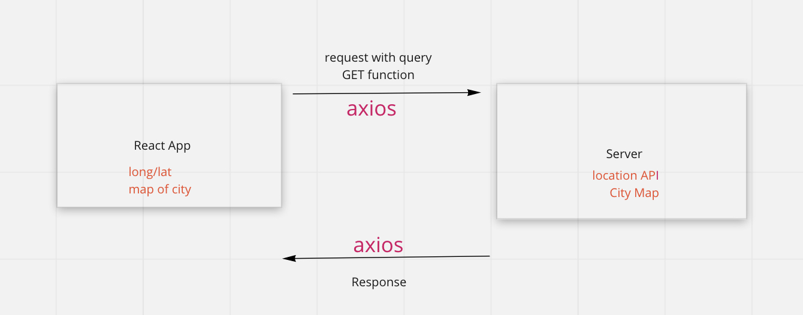
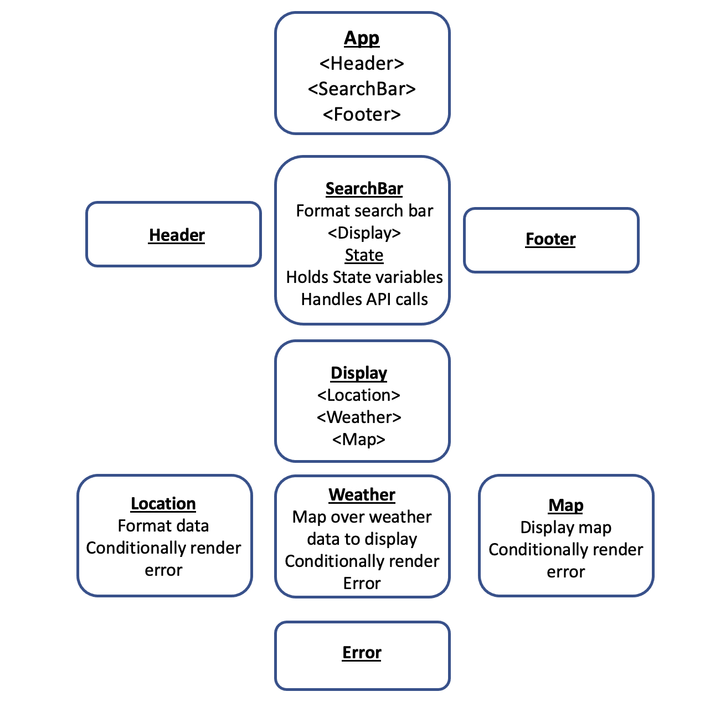

# City Explorer

**Author**: Monika Davies
**Version**: 1.0.2

## Overview

City Explorer allows users to look up US cities to see a map, local weather, local restaurants, and movies related to that city.

## Getting Started

## Architecture

This is a React app that uses Bootstrap. API calls are made with Axios. It uses
the following WRRC:

Component Organization:

## Change Log

- Enabled API calls to LocationIQ to get latitude, longitude, and map

- Update map and data display

- Handle error from bad search and display error status code

## Credit and Collaborations

WRRC flowchart created together with Lauren Main
Error handling assistance from Hexx King and Ray Ruazol