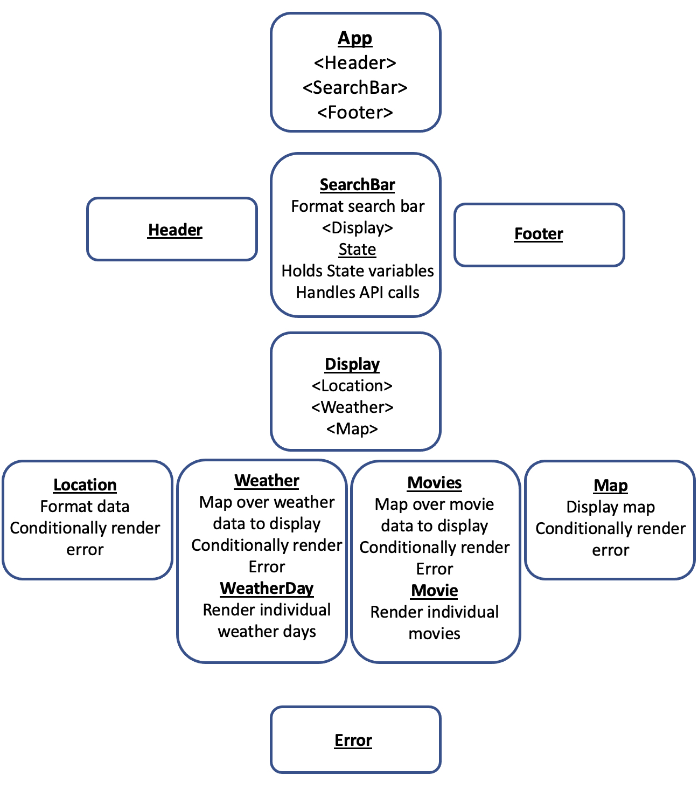

# City Explorer

**Author**: Monika Davies\
**Version**: 1.0.2

## Overview

Note: The backend was redeployed to Render following changes to Heroku's free tier, causing slow initial load times, which typically improve after a few minutes of use. The app will eventually be redeployed to address this issue. Live site link below. Scroll down for images of fully loaded site.

Live Site: [mcd-city-explorer.netlify.app/](https://mcd-city-explorer.netlify.app/)

Frontend Repo: [github.com/MonikaChris/city-explorer](https://github.com/MonikaChris/city-explorer)\
Backend Repo: [github.com/MonikaChris/city-explorer-api](https://github.com/MonikaChris/city-explorer-api)

City Explorer allows users to enter US cities to retrieve a map, five days of local weather, local restaurants, and movie titles related to that city. Restaurants and movies are presented in accordions. The collapsed restaurant accordion displays the name, cuisine type, rating, and price range. Expanding an entry reveals a photo and website link. The collapsed movie accordion shows movie titles, while the expanded entries include a plot description, release date, popularity rating, and movie poster. Movie lists are cached for faster load times, and the date of last refresh is printed below the accordion.

## Live Site Images

## Architecture

React Component Organization:

